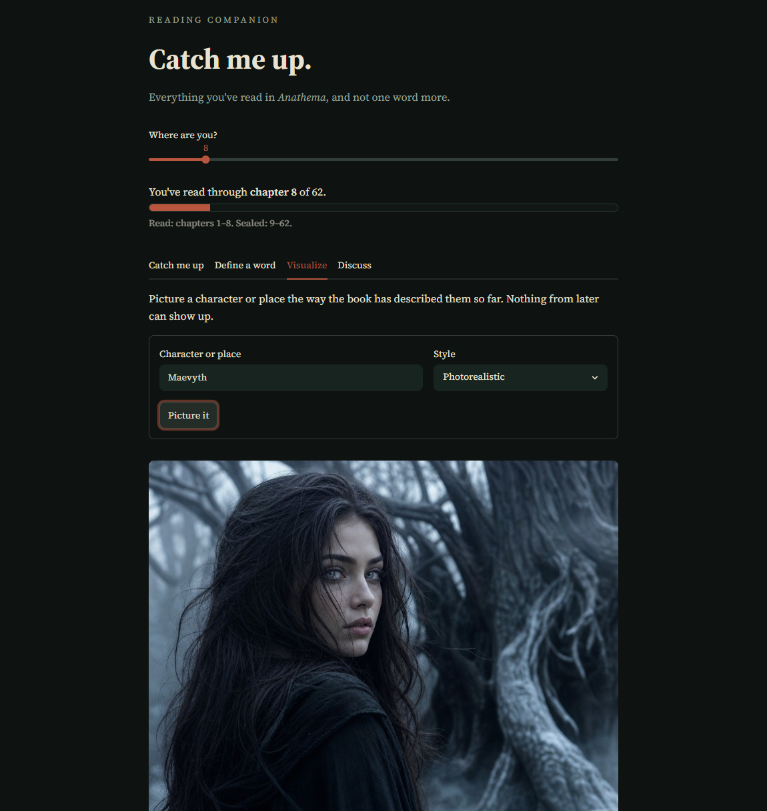

# Spoiler-Safe Reading Companion

A reading assistant that catches you up on a book, explains its words, pictures its characters, and discusses its plot without ever revealing a single word past where you are.

You set one thing: the chapter you're on. Every feature respects that boundary. The language model is never shown the chapters you haven't read, so it physically *can't* spoil them.



## Features

- **Catch me up**: a spoiler-free recap of the story so far.
- **Define a word**: explains a word or an invented lore term using only the passages you've read. (Your e-reader's dictionary can't define a made-up fantasy word. This can.)
- **Visualize**: generates a portrait of a character or place as the book has described them *up to your current chapter*. A scar a character gets later won't appear until you've read it.
- **Discuss**: a book-club chat partner that analyzes characters, motives, and themes, grounded in what you've read, with no spoilers and a memory of the conversation.

Plus a built-in **leak test**: an evaluation that scans a recap for any name introduced after your current chapter, and proves the guard works by catching the leaks in a recap that *was* allowed to read ahead.

## How it works

The whole thing rests on one idea: tag every piece of the book with where it sits, then never use anything past the reader's position.

1. **Extract** the book's text from an EPUB, in reading order (`epub_loader.py`).
2. **Chunk** it into ordered passages, each tagged with its chapter and position (`chunker.py`). Chapters are detected even when a book lists them one way in its table of contents and another way in its body.
3. **Bound**: `chunks_through(chunks, max_chapter=N)` returns only what's been read. Every feature draws from this.
4. **Layer features on top** — the recap summarizes the allowed text; define and visualize pull the relevant allowed passages; discuss runs semantic search over a vector index (`book_index.py`) bounded to the allowed chapters.

Because the recap is built only from chapters 1–N, it can't contain a spoiler — and the leak test proves it by checking for names that first appear later.

## Setup

Requires Python 3.10+ and an OpenAI API key.

```bash
python -m pip install -r requirements.txt
```

Create a `.env` file (copy `.env.example`) with your key:

```
OPENAI_API_KEY=sk-your-key-here
```

Add an EPUB of a book you own to the project folder, and set its filename in `recap.py`:

```python
BOOK = "yourbook.epub"
```

Run the app:

```bash
python -m streamlit run app.py
```

Each piece also runs on its own, e.g. `python recap.py` or `python leak_test.py`.

> Note: image generation uses OpenAI's GPT Image model, which may require a one-time organization verification in your OpenAI account.

## Files

| File | What it does |
|------|--------------|
| `app.py` | The Streamlit app that ties everything together |
| `epub_loader.py` | EPUB → plain text, in reading order |
| `chunker.py` | Splits the book into chapter-tagged chunks; defines the spoiler boundary |
| `book_index.py` | Vector index + spoiler-bounded semantic search |
| `recap.py` | The spoiler-free recap |
| `leak_test.py` | The evaluation that proves recaps don't leak |
| `vocab.py` | Define a word in context |
| `visualize.py` | Generate a character or place image |
| `discuss.py` | The discussion chat |

## A note on books

This tool works on a book *you* provide. It includes no book text — bring your own EPUB of something you own.

## Built with

Python · Streamlit · OpenAI (chat, embeddings, image) · Chroma

---

## Author

**Julisa Delfin** - MS Data Science, MS Artificial Intelligence, DePaul University

MIT - [LICENSE](LICENSE)

[](https://www.linkedin.com/in/julisadelfin/)
